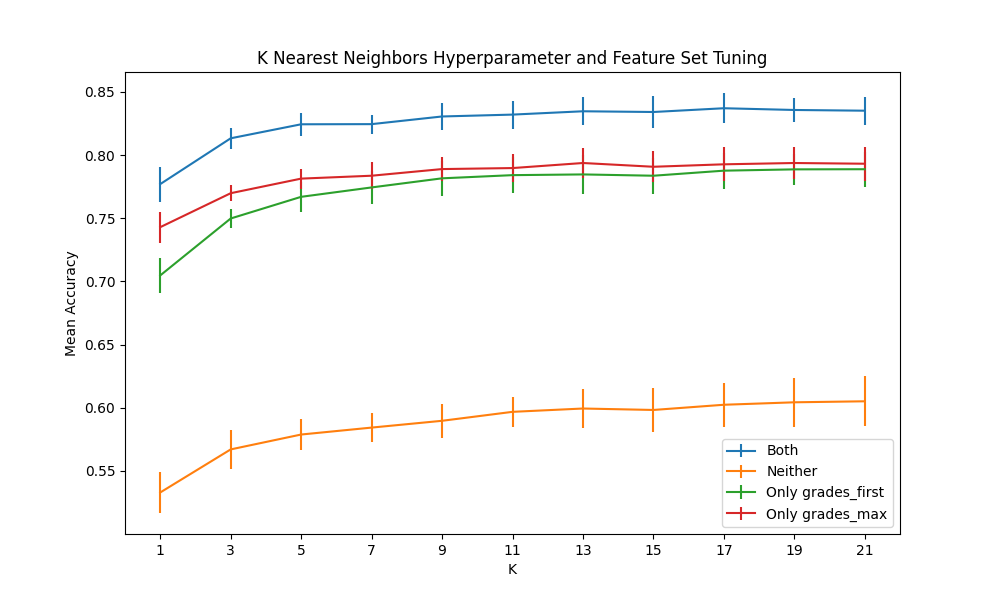
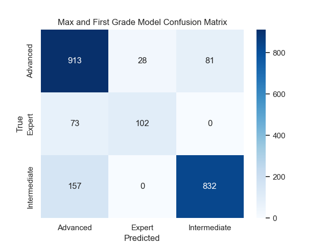
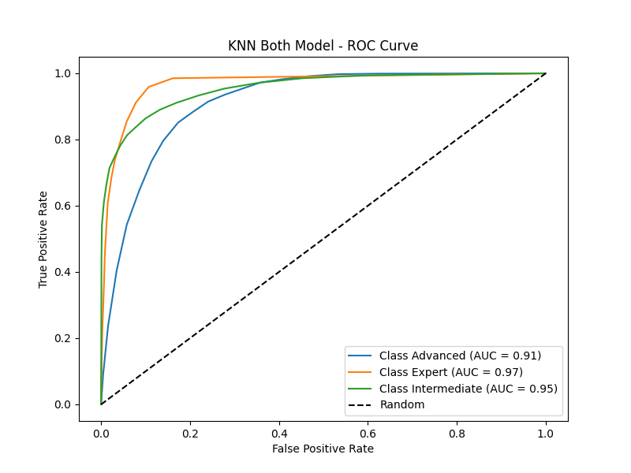
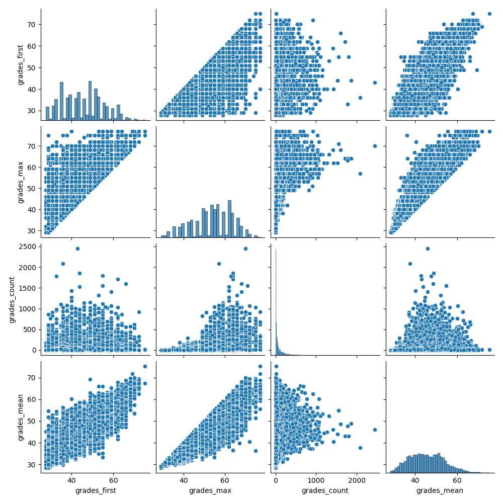
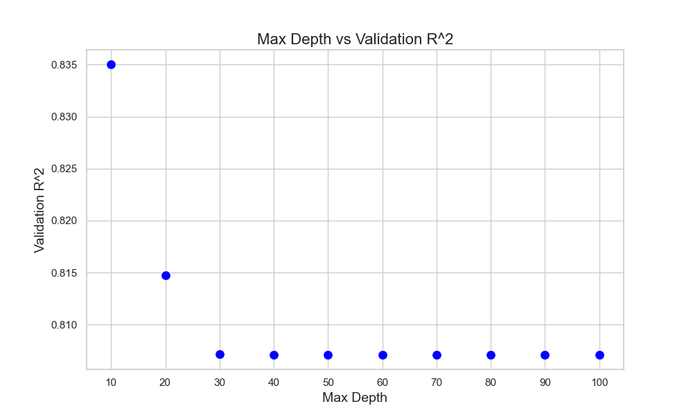

# ToSendOrNotToSend
## Project Overview
This project uses different machine learning methods to attempt to predict a rock climber's skill level and maximum grade. The data used to build the models is the [8a.nu dataset](https://www.kaggle.com/datasets/jordizar/climb-dataset) from Kaggle.

## Dataset
Upon inspection of the 8a.nu dataset from Kaggle, it is obvious that most of the data recorded are from professional climbers. This poses issues for maching learning algorithms due to the lack of variance.

The density plot below shows the distributions for each feature. With the exception of grades_count, the feature values are mostly centered about the mean and have little variation. Additionally, the values of grades_max, grades_mean and grades_first are quite similar to one another. This reinforces the suspicion that this data is from professional climbers, because a pro climber's first grade will likely be near their maximum and mean grade due to the high level of skill they are climbing at.

The plot below shows the correlation matrix heatmap for the features. The most heavily correlation features are grades_max vs. grades_mean, grades_max vs. grades_first, grades_first vs grades_mean, height vs weight, and age vs years_climbing.

## Machine Learning Models
Two different machine learning tasks are defined: classification and regression. The classification task aims to predict the climber's skill level (defined using grades_mean). The regression task aims to predict the climber's grades_max. 

Skill Level Bins:
* Intermediate: grades_mean <= 6b/c (5.12a)
* Advanced: 6b/c (5.12a) < grades_mean <= 7c (5.13c)
* Expert: grades_mean > 7c (5.13c)

### Classification
K-Nearest Neighbors is used for the classification task. Tuning of the feature set (sex, height, weight, age, number of years climbing, number of routes completed, first grade, and maximum grade) and the number of neighbors was also completed.

Feature Set Tuning (vary inclusion of first and max grade due to high correlation with mean grade):
* Both: Sex, height, weight, age, number of years climbing, number of routes completed, first grade, maximum grade
* First: Sex, height, weight, age, number of years climbing, number of routes completed, first grade
* Max: Sex, height, weight, age, number of years climbing, number of routes completed, maximum grade
* Neither: Sex, height, weight, age, number of years climbing, number of routes completed

### Regression
Linear and random forest regressors were trained on features in both independent models and cohesive models (using all features at once) to predict grades_max from sex, height, weight, age, number of years climbing, number of routes completed, first grade, and mean grade. The max_depth random forest hyperparameter was tuned.

## Results

### Classification
The following figure shows the results of the KNN feature set and K hyperparameter tuning.

As expected, the feature set including both first and maximum grade achieved the highest accuracy. The feature set only including maximum grade did slightly better than the set only including first grade. The set excluding first and maximum grade still achieved reasonably high performance.

The most frequent misclassification occured when the model predicted Advanced, but the climber was actually Intermediate.

This indicates the the feature values for advanced climbers are more similar to intermediate climbers than the feature values for advanced climbers are to the values for expert climbers, so it is easier for the model to distinguish expert climbers. The ROC curves support this conclusion.

### Regression
#### Linear Regression
The model using all features achieved an R-Squared of 0.833. Most of its success can be attributed to the strong correlations between mean, first and maximum grade.

#### Random Forest Regression
Due to the lack of linearity between our features and maximum grade, a random forest regressor was used to see if performance improves. The model including all features resulted in an R-Squared value about ten percent higher than the full linear regression model's R-Squared, and the random forest model's RMSE was significantly lower than the linear model's. The largest difference we saw between the two models was in the model using grade count only to predict maximum grade. The R-Squared value for the random forest regressor, 0.34, was two times as high as the R-Squared value for the linear regressor. Of the three best performing single feature models, mean grade, first grade, and grade count, grade count is the least linear. Random forest regression does not make the linearity assumptions that linear regression does, hence its superior performance.

The optimal maximum depth of trees in the forest wasxthe smallest value tested, ten splits. Performance decreased with twenty and thirty splits, and did not change for maximum depths from thirty to one-hundred in increments of 10.

