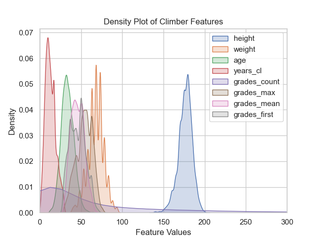
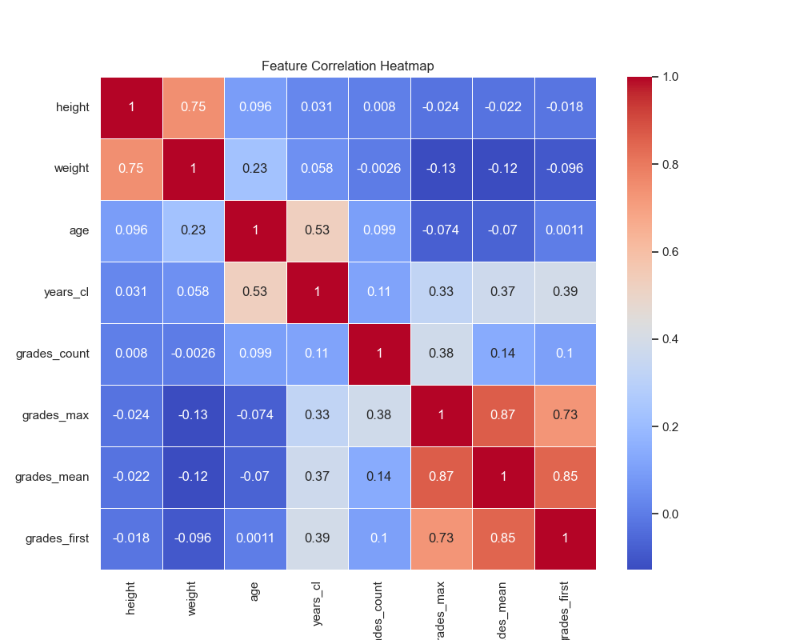

# ToCrushOrNotToCrush
## Project Overview
This project uses different machine learning methods to attempt to predict a rock climber's skill level and maximum grade. The data used to build the models is the [8a.nu dataset](https://www.kaggle.com/datasets/jordizar/climb-dataset) from Kaggle.

## Dataset
Upon inspection of the 8a.nu dataset from Kaggle, it is obvious that most of the data recorded are from professional climbers. This poses issues for maching learning algorithms due to the lack of variance.

The density plot below shows the distributions for each feature. With the exception of grades_count, the feature values are mostly centered about the mean and have little variation. Additionally, the values of grades_max, grades_mean and grades_first are quite similar to one another. This reinforces the suspicion that this data is from professional climbers, because a pro climber's first grade will likely be near their maximum and mean grade due to the high level of skill they are climbing at.

The plot below shows the correlation matrix heatmap for the features. The most heavily correlation features are grades_max vs. grades_mean, grades_max vs. grades_first, grades_first vs grades_mean, height vs weight, and age vs years_climbing.

## Machine Learning Models
Two different machine learning tasks are defined: classification and regression. The classification task aims to predict the climber's skill level (defined using grades_mean). The regression task aims to predcit the climber's grades_max. 

### Classification
K-Nearest Neighbors is used for the classification task. Tuning of the feature set and number of neighbors was done.

### Regression
Linear and random forest regressors were trained on features in both independent models and cohesive models (using all features at once).
